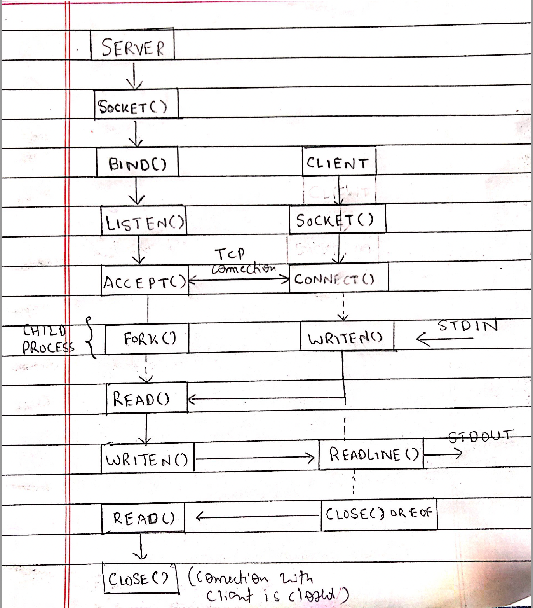
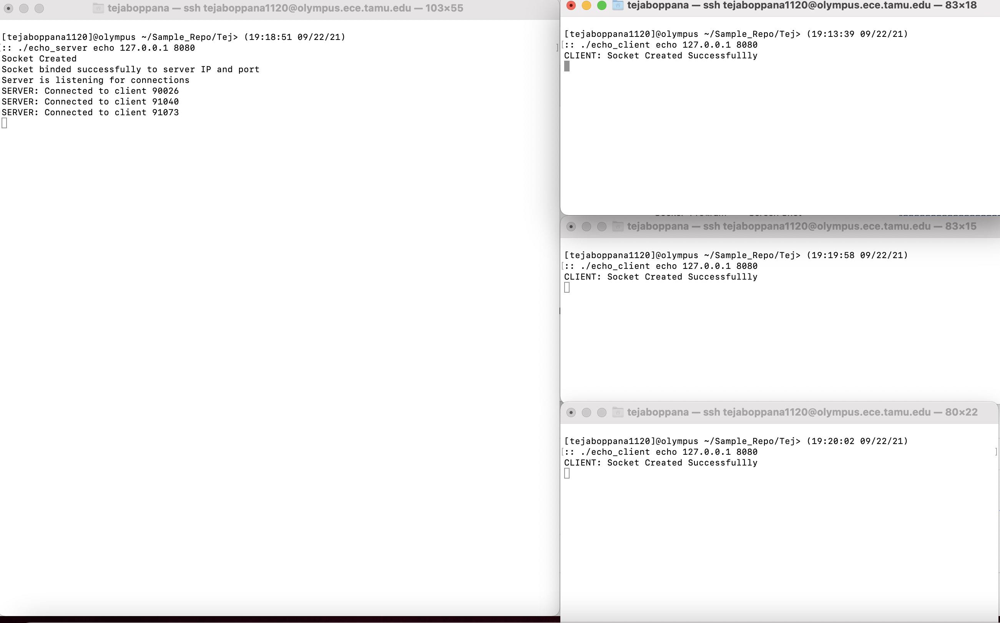
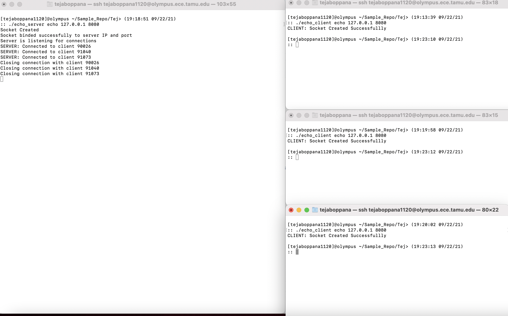

**MACHINE PROBLEM 1 : ECEN 602 - ECHO CLIENT-SERVER**

*Contributers - Tejasri Swaroop Boppana and Ye Ying Yan*

1. The code involves creating a client-server model using the system calls available in Linux. 
2. The Client-Server model works as below:

- A socket is created and binded with the server's IP address and a port. 
- Server starts listning to the connections
- A socket for client is created and it establishes a connection with the socket using the connect() function.
- Server accepts the connection (via TCP 3 way handshake) and then creates a child process to handle the client. (This is in order to ensure that multiple clients can connect to the server)
- Client sends a message to the Server. (The message is obtained via stdin , i.e input to the terminal)
-  Server reads the message and sends the same message back to the client.
- Finally Client reads this echoed message and outputs the same in the terminal. 

3. Below is the architecture diagram of the echo client-server model. 

4. We have tested the code and below are the screenshots :

.png)

- Multiple Clients connected to server . 

- All the clients are disconnected. 

CONTRIBUTION:

- The server code and test.sh is contributed by Ye Ying Yan. 
- The client code, REAME.md and makefile is contributed by Tejasri Swaroop Boppana

Steps to test the code :

1. Open 2 terminals , one for client(When testing with multiple clients open mutiple terminals for client) and one for server 
2. Run `make echo_server` 
3. Run `make echo_client`
4. In the server terminal run  `./echo_server echo <server_IP> <port_no>` , EX: `./echo_server echo 127.0.0.1 8080`. This will start the server.
5. In order to start the Client, in the client Terminal run `./echo_client echo <server_IP> <port_no>` , EX: `./echo_server client 127.0.0.1 8080`.
6. However, in order test the code (for the first 4 test cases) , we have created a test.sh shell script. Hence you can run the below command 
     `./test.sh`
7. In order to check for connections with multiple clients, open miultiple terminals and try connecting to the server. We have set the `BACKLOG` for the listen() function (in the server code , echo_server.c) to 4. Hence, it can accept connections from 4 clients. This value can be changed in the mp1.h file. 

*REFERENCES*

1. W. Richard Stevens, Bill Fenner, and Andrew M. Rudoff, Unix Network Programming, Volume 1, The Sockets Networking API, 3rd Edition, Addison- Wesley, 2004, Chapter 1.
2. W. Richard Stevens, et. al., op. cit., Chapter 3.
3. W. Richard Stevens, et. al., op. cit., Chapter 5.
4. Beej's Guide to Network Programming, Chapter 6. 
