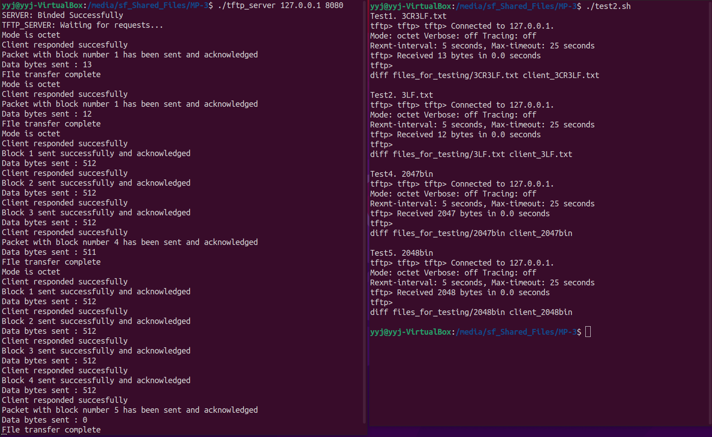
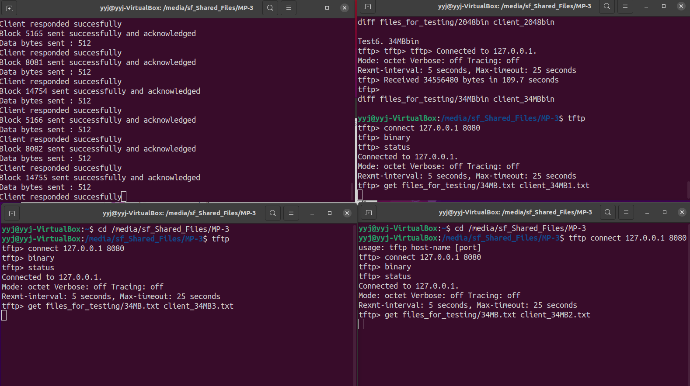
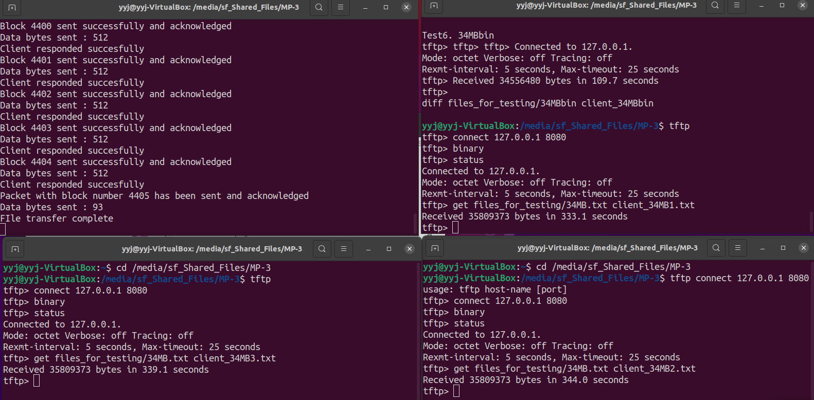
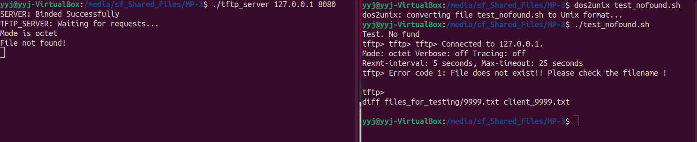

*Contributers - Tejasri Swaroop Boppana and Ye Ying Jan*

The code does the following :

1. Creates a TFTP server.
2. Accepts the RRQ requests from TFTP clients and serves the requests.
3. The server supports both netascii and octet mode.
4. Server also keeps track of timeout incase the the client gets disconnected. 
5. It supports transfer to multiple clients at the same time. 

CONTRIBUTION:

- The server code,Makefile and README file was contributed by Tejasri Swaroop Boppana. 
- The timeout implementation,Zombie process handling and testing was contributed by Ye Ying Jan.

Steps to test the code :

1. Open the terminal/s.  
2. Run `make all` 
3. In the server terminal run  `./tftp_server <server_IP> <port_no>`, EX: `./tftp_server 127.0.0.1 8080`. This will start the TFTP server. 
4. Install the TFTP client and then run the below command :
    - `tftp`
    - This will open the tftp command line , then run - `connect <Server IP> <Port>` , EX: `connect 127.0.0.1 8080`
    - In order to check the status of the connection , run `status`
    - In order to change the mode , run `binary` for octet mode and `ascii` for netascii mode
    - Run the following command to get a particular file from the server - `get <file_in_server> <name_of_the_file_to_be_created>`

TESTING:

We have created a report for all the test cases in following photos. 

- Server and Client
- We checked that the files are same using the diff command.  
- Test case 1 - Transferred an ascii file with 3CR3LFs and it was successful.
- Test case 2 - Transferred an ascii file with 3LFs and it was successful.
- Test case 3 - Transferred a binary file of size 2047 MB and it was successful.
- Test case 4 - Transferred a binary file of size 2048MB and it was successful.
- Test case 5 - 3 clients trying to download the file at the same time .
- Test case 6 - Client is trying to access a file that does not exist and server throws an error saying that the file is not found.  

- 3 Client request at same time

3 clients are transmitting

3 clients success

File not found

